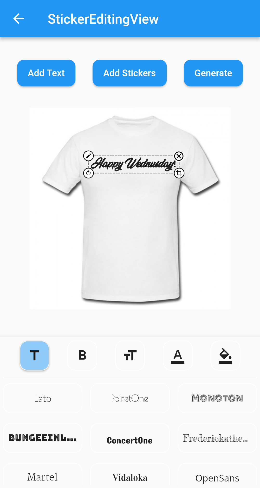
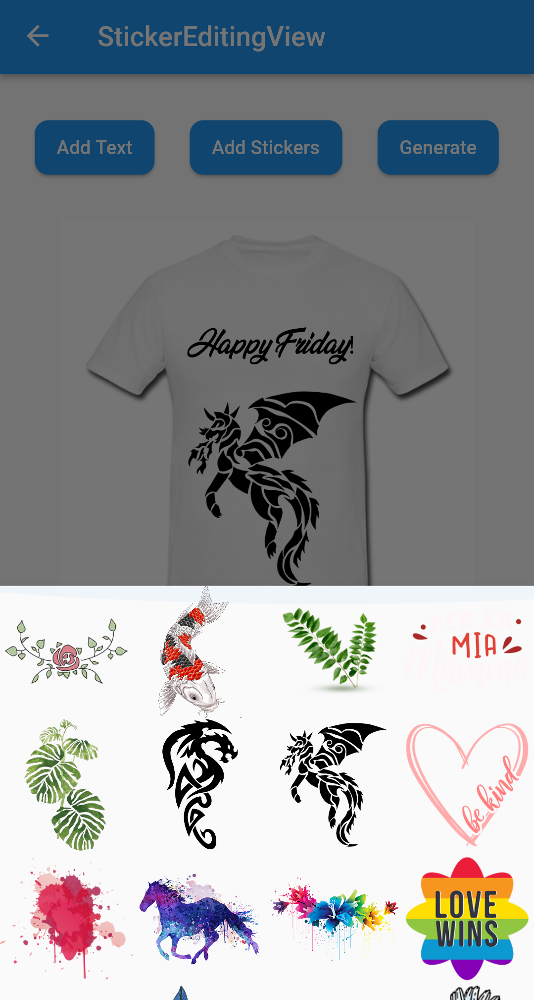
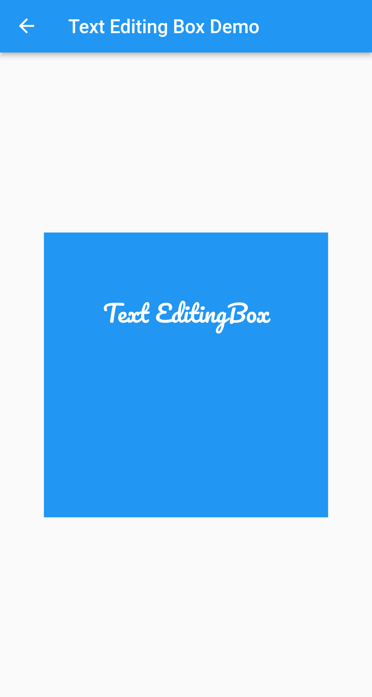
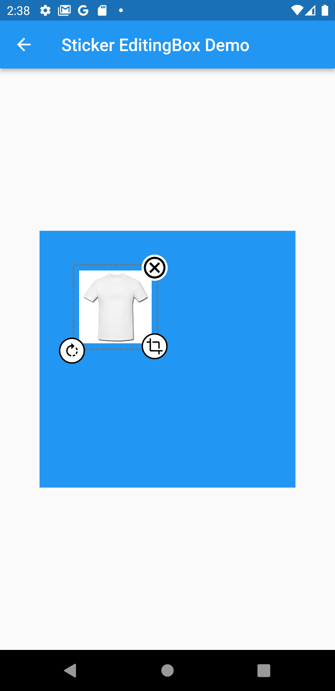

<br>

| Sticker Editor                           |                                             |
| ---------------------------------------- | ------------------------------------------- |
|  |  |

<br>

<br>

| Only Text                             | Only Photo                         |
| ------------------------------------- | ---------------------------------- |
|  |  |

<br>

 

A flutter package which will help you to create editable and scalable text or Sticker widget that can be dragged around the area you given in screen.

[](https://opensource.org/licenses/MIT)

## Features 💚

- Manually Control the position of the widget along with drags.
- You can resizes widget using scaling function
- Highly customizable
- You can use whole sticker view or particular widget

## How to use
- Sticker View 
```Dart
StickerEditingView(
  fonts: fonts,
  palletColor: colorPallet,
  assetList: stickerList,
),
```

- Text Editing Box
```Dart
Container(
  height: 300,
  width: 300,
  color: Colors.blue,
  child: Stack(
    children: [
      TextEditingBox(
        fonts: fonts,
        boundHeight: 200,
        boundWidth: 100,
        isSelected: true,
        palletColor: colorPallet,
        newText: TextModel(
            name: 'Text EditingBox',
            textStyle:
                GoogleFonts.pacifico(fontSize: 25, color: Colwhite),
            top: top,
            isSelected: true,
            textAlign: TextAlign.center,
            scale: 1,
            left: left),
      ),
    ],
  ),
),
```
- Picture Editing Box
```Dart
Container(
  height: 300,
  width: 300,
  color: Colors.blue,
  child: Stack(
    children: [
      StickerEditingBox(
          boundHeight: 200,
          boundWidth: 200,
          pictureModel: PictureModel(
            isNetwork: true,
            isSelected: false,
            left: 50,
            top: 50,
            scale: 1,
            stringUrl:
                'https://raw.githubusercontent.com/Harsh-Radadiya/sticker_editor/master/assets/t-shirt.jpeg',
          )),
    ],
  ),
)
```

Run the example app in the exmaple folder to find out more about how to use it.
